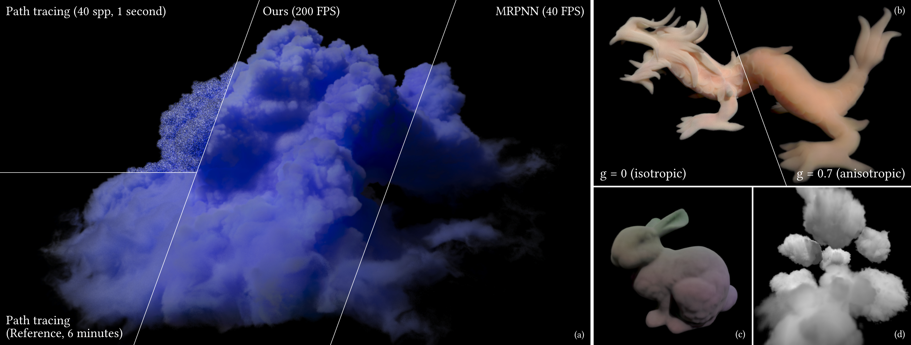
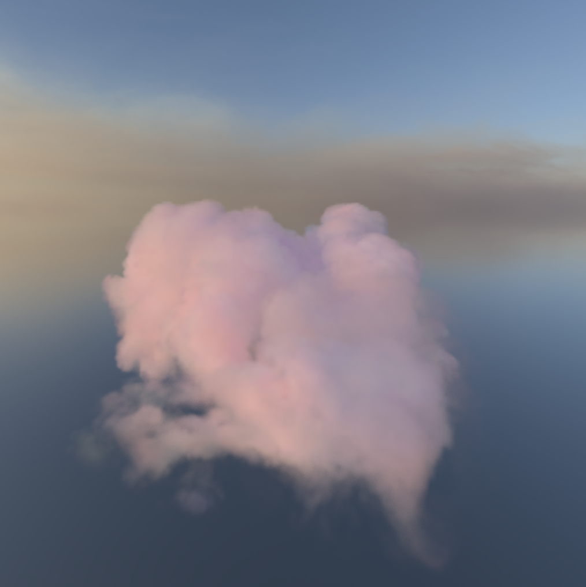

# MRBNN
<p align="center">
  <a href="https://extra-creativity.github.io/projects/MRBNN"><b>🔗Project Page</b></a> |
  <a href="https://extra-creativity.github.io/assets/pdf/MRBNN/paper.pdf"><b>📄 Paper </b></a> |
  <a href="https://extra-creativity.github.io/assets/pdf/MRBNN/supplementary.pdf"><b>📄 Supplementary </b></a>
</p>




## About

This repository contains the neural volumetric renderer used by SIGGRAPH 2026 Paper *Multi-feature Radiance Baking Neural Networks for Instant Volumetric Rendering*. By our neural baking and decoder design, it can render complex volumes with high-quality multi-scattering effects in real time. See our paper for details!

<p align="center">
    
</p>

> Note: For the company policy, the training code and dataset are not released and this repository has the license that ONLY allows for non-commercial uses. See the LINCESE for details. 

## Setup

### Environment

+ C++20-compatible C++ & CUDA compiler; We've tested it on msvc 19.44 + CUDA 12.6 / 13.0.
+ CMake; We've tested on CMake 3.31 and 4.2. 
+ Possible adjustment to root CMakeLists.txt:
  + We set `CMAKE_CUDA_ARCHITECTURES` to `89` for it corresponds to NVIDIA 40XX series. You can adjust it according to NVIDIA official document [CUDA GPU Compute Capability](https://developer.nvidia.com/cuda/gpus) depending on your own GPU, especially if the supported architecture is less than `89` (so that it may encounter either compilation error or runtime error).
  + We use `FetchContent` to make the project self-contained, so you're supposed to be able to access Github during CMake configuration, say by `set(ENV{http_proxy})` and `set(ENV{https_proxy})`.

Also, though all dependency libraries are cross-platform (except that GUI to open folder is written in Windows Native API), we don't test compilation on Linux. Adjustment to Linux GUI may need a bit of additional efforts.

### Build

You can open the folder with your IDE to do automatic configuration and build (**in Release mode** to get fully optimized executable). If you want to do so manually, run commands below:
```bash
mkdir build
# Configure the project.
cmake -S . -B build
# Build the target.
cmake --build build --config Release --target main -j 32
```

Note: We don't strictly manage encoding of all file paths, so it's recommended to ensure that root path of the project contains only ASCII characters.

## Usage

### Data

We provide three sample baking data in `data/` to cover typical cases in our paper.

1. Cloud1: a normal volume. **Particularly, you need to download the volume [data sample](https://1drv.ms/f/c/c6d71596bc679f33/QjOfZ7yWFdcggMZJBAAAAAAATuOe1hNOeD_D7Q) provided by MRPNN and save it as `data/volumes/CLOUD1.bin`** and it needs 4GB. Also, we upload the 3D view encoding mentioned in our supplementary.
2. Bunny-albedo: a volume that supports albedo grid. Unzip the `data/volumes/albedo_render.zip` and move `albedo_render.bin` to `data/volumes`.
3. Cloud-03: a normal volume with baking of ambient light.

### Folder selection

Click "Select working directory", and select one of the data folder mentioned above, then you can see our sample scene!

<p align="center">
	
</p>

Their parameters are already properly specified, but we still list some details in option panel:

1. Volume - Fast Direct Illumination: Since our method needs to establish transmittance map, transmittance of direct illumination can be approximated by sampling the map.
2. Load / Save menu configuration: If you have some settings (lighting, material parameters, etc.) that want to re-load next time, you can load it from / save it to json. When saving to a new file, you need to create it first and overwrite it instead of specifying a new name directly.
3. Skybox:
   + Select skybox HDRI: e.g. `data/qwantani_sunset_puresky_4k.hdr`.
   + Select baking: baking directory of the environment light, e.g. `data/cloud-03/skybox`.
   + Stochastic illum: draw directions stochastically like MRPNN does instead of rendering by baking.

## BibTex

```tex
Coming soon...
```

## FAQ

1. Light scale: If you use a standard PT renderer with our parameters, you may find that it's obviously darker. The reason is that MRPNN scales all its lighting by $\pi$ and we align with its behavior to compare conveniently.
2. Redundant baking data: We store some separate MLP data like `mlp0.weight0.bin`, but they're already deprecated and not used anymore; only TCNN ones are currently used. Nevertheless, these deprecated data are required to pass some legacy code in the repo.
3. Possible ICE: For C++/CUDA compiler bugs that cause internal compiler error (ICE), we note that:
   + To successfully build ExternalTCNN for the first time, you may need to build it twice since we find that it occasionally encounters wrong compiler flags and ICE. If corrupted link files are reported, you can either find and delete it or clean and rebuild. But this seems to only happen for the first time.
   + We have to use C++17 instead of C++20 canonically for tcnn-related code, otherwise ICE occurs in tcnn headers. We also notice possible ABI incompatibility since tcnn library is compiled with `-std=c++14`, but practically it's okay for kindness of vendors. Nevertheless, we isolate them as shared library to minimize such reliance.
4. For running some targets except for `main` in Windows, you may need to copy ExternalTCNN.dll to the executable directory though they don't really use TCNN, since shared libraries are eagerly loaded when specified in CMake.
5. GLAD2: We include glad2 in our repository directly but you can also generate it yourself and see `src/display/CMakeLists.txt` for details. The reason we include it directly is that some users may be unable to configure it properly.
